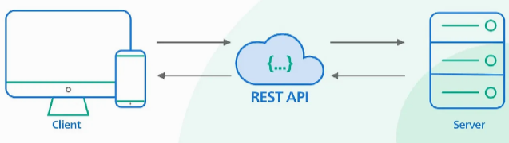
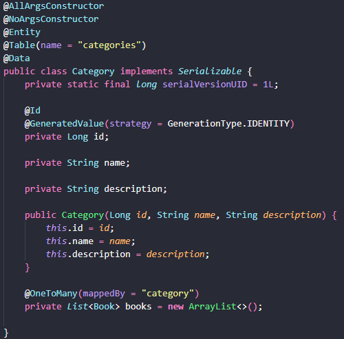
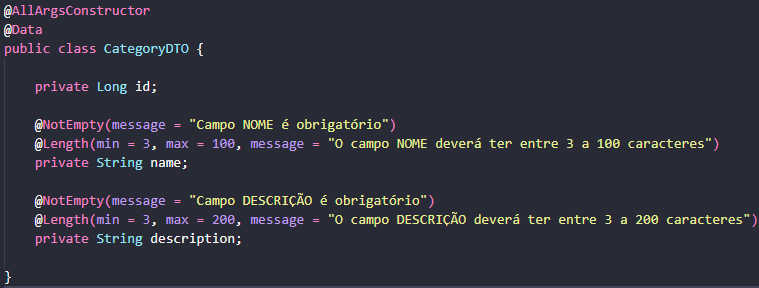
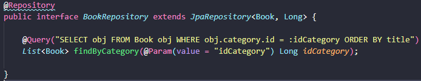
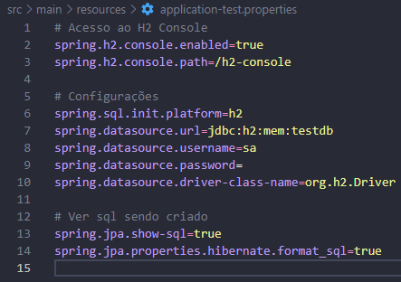
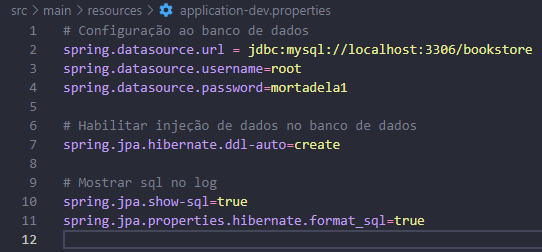

# Construção de Apis utilizando boas práticas com Spring Boot

## Para que serve esse post

A ideia deste post é trazer uma noção sobre o desenvolvimento de **api rest** utilizando o ecossistema [*Spring*](https://spring.io/projects), mais específico o [*Spring Boot*](https://spring.io/projects/spring-boot), onde serão abordados os métodos HTTP que auxiliarão nos métodos de criação, atualização, para deletar e leitura da api.

Também será abordada a utilização de padrões de design e organização de pacotes.

## API

A sigla *API* vem do inglês *Application Programming Interface* ou no português, Interface de Programação de Aplicativos. Com o objetivo de reutilização, são uma solução baseada no desacoplamento de sistemas seguindo suas definições e protocolos onde os componentes que o formam possam interagir entre si, isso proporciona diversas vantagens no desenvolvimento, pois será necessário apenas um *back-end* para se comunicar com diversas aplicações no *front-end*, podendo ser *web* ou *mobile*. Os formatos de comunicação mais conhecidos no mundo *web* desses dois "mundos", são o [*JSON*](https://pt.wikipedia.org/wiki/JSON) e o [*XML*](https://pt.wikipedia.org/wiki/XML).

A separação dessas responsabilidades em sistemas distribuídos corrobora para que cada camada possa evoluir de forma independente. Um grande exemplo muito utilizado é o serviço de geolocalização do *Google Maps*, em diversos clientes como aplicativos de *delivery*, transporte, trânsito (até mesmo pessoas que só andam perdidas kkkkk), utilizam seu serviço.

Vale ressaltar que a *API* não está diretamente associada a uma linguagem de programação, segundo GOUVEIA a *API* é como um garçom de um restaurante. O cliente, neste caso a aplicação que deseja receber os serviços,recebe do garçom o menu com todos os itens daquele restaurante. Ao escolher uma opção o garçom leva este pedido até a cozinha, aplicação da *API*, onde por sua vez os cozinheiros, que são os serviços compartilhados pela aplicação, realizam o pedido como foi descrito pelo cliente. Ao concluir o pedido o cozinheiro avisa o garçom, este por sua vez entrega o pedido ao cliente completando o processo de exemplificação uma requisição de *API*.

### Arquitetura REST

A sigla *REST* vem do inglês *Representational State Transfer* ou no português Tansferência de Estado Representacional, abaixo segue uma ilustração representando essa arquitetura para sistemas distribuídos.

Tilkov (2007, n.p., Trad. Google Translate) define REST como:
> um conjunto de princípios que definem como os padrões da Web, como HTTP e URIs, devem ser usados (o que muitas vezes difere um pouco do que muitas pessoas realmente fazem). A promessa é que, se você aderir aos princípios do REST ao projetar seu aplicativo, terá um sistema que explora a arquitetura da Web em seu benefício.

Então a utilização de *URI* na arquitetura *REST* faz com que todos os seus recursos sejam acessados por seus identificadores, exemplo em uma api para uma livraria [*BookStore*](https://github.com/TaylanTorres09/book-store-api) (criada pelo autor), onde tem-se requisições, seguem duas de exemplo.

- Criar livros http://localhost:8080/book/create
- Consultar categorias: http://localhost:8080/category/categories

O consumo de *APIs REST* é feito utilizando o protocolo [*HTTP*](https://www.alura.com.br/artigos/desmistificando-o-protocolo-http-parte-1), onde os verbos mais comuns são:

- GET: Solicita a leitura de um recurso, retornando apenas os dados.
- POST: Solicita a criação e injeção de dados.
- PUT: Substitui todas as atuais representações do recurso de destino pela carga de dados da requisição.
- DELETE: Remove um recurso específico.

## Spring [Initializr](https://start.spring.io/)

Após um apanhado geral para termos uma ideia sobre o que é *API*, *REST* e os métodos *HTTP*, vamos colocar a "mão na massa", com um exemplo real que consistem na criação de uma *API* para uma biblioteca, onde os livros serão cadastrados, atualizados e deletados. Cada livro terá uma categoria associada, onde para cadastrar um livro deverá preexistir uma categoria para o mesmo. Para mais informações acesse o [*README*](https://github.com/TaylanTorres09/book-store-api/blob/main/README.md) da aplicação.

Para facilitar a criação de aplicações utilizando outras [IDEs](https://www.redhat.com/pt-br/topics/middleware/what-is-ide) a [*Spring*](https://spring.io/projects) disponibilizou o [*Spring Initializr*](https://start.spring.io/), onde é permitido a criação de projetos, podemos definir nome de pacote, dependências e linguagem (Java, Groovy e Kotlin).

## Model

Este é o pacote que contém as informações da entidade do projeto, contendo classes com um ou mais construtores e atributos.

Abaixo segue exemplo da [entidade categoria](https://github.com/TaylanTorres09/book-store-api/blob/main/src/main/java/com/bookstore/bookstore/models/Category.java) da *API* para livraria.

Neste projeto foi utilizado a biblioteca [Lombok](https://projectlombok.org/), utilizada para redução de código *boilerplate*.

## DTO - Objeto para transferência de dados

O padrão de *Data transfer object* ou simplesmente *DTO* é um padrão de arquitetura de objetos que agregam e encapsulam dados para transferência. Sua função é obter, armazenar e filtrar dados da nossa camada de persistência.

Abaixo vemos o *DTO* da entidade categoria, onde utilizamos tanto para obter dados como para filtrar, pois é "escondido" os livros.

## Repository

Cada classe implementada no *model* deverá possuir uma interface de acesso ao banco de dados, é a partir deste momento onde surgisse a ideia da camada de *repository* e para que haja persistência nas nossas classes, precisamos utilizar o [*Spring Data*](https://spring.io/projects/spring-data). Para o projeto de exemplo foi utilizando o [*Spring Data JPA*](https://spring.io/projects/spring-data-jpa).

### Banco de dados

Um banco de dados é uma coleção organizada de informações ou dados estruturadas, normalmente armazenadas eletronicamente em um sistema de computador.

Para o projeto de exemplo foram criados dois perfis, um para testes (*test*) e outro para desenvolvimento (*dev*), seguem as configurações do *application.properties* dentro da pasta [*recourses*](https://github.com/TaylanTorres09/book-store-api/tree/main/src/main/resources) criada pelo [*Spring Initializr*](https://start.spring.io/).

Para o perfil *test* foi utilizado o Banco [H2](https://www.h2database.com/html/main.html) utilizado em memória, coloquei neste pois é um banco de fácil configuração e utilização.

- Para o perfil *dev* foi utilizado o Banco [MySQL](https://www.mysql.com/products/workbench/).

- Para seleção do perfil **test** para perfil de teste e **dev** para perfil de desenvolvimento.

## Service

## Controller

## Conclusão e discurssões

## Referências

Disponível em [DESENVOLVIMENTO DE API REST COM SPRING BOOT](https://www.unirios.edu.br/revistarios/media/revistas/2021/29/desenvolvimento_de_api_rest_com_spring_boot.pdf) Acesso: Fev/2023. 

Ilustração REST API, disponível em: [Why is RESTful API so popular?](https://blog.bytebytego.com/p/why-is-restful-api-so-popular) Acesso: Fev/2023.

DTO, disponível em: [Design Patterns - DTO](https://javabahia.github.io/falando-sobre-dto/) Acesso: Fev/2023.

O que é um Banco de Dados? disponível em: [O que é um Banco de Dados?](https://www.oracle.com/br/database/what-is-database/#:~:text=Um%20banco%20de%20dados%20%C3%A9,banco%20de%20dados%20(DBMS).) Acesso Fev/2023.